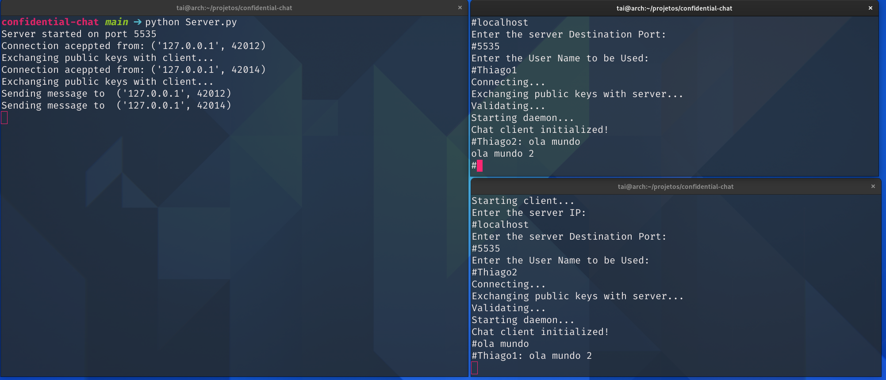
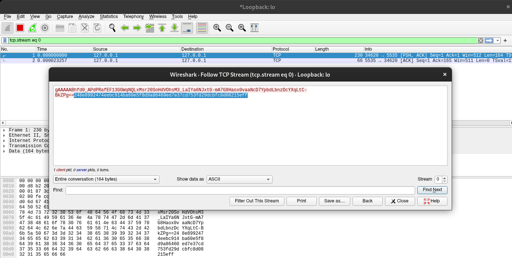

# Confidential-chat
Esta é uma modificação do projeto original de [grakshith/p2p-chat-python](https://github.com/grakshith/p2p-chat-python), o qual implementa um chat em python, cliente-servidor, que funciona através da rede. Este projeto, adiciona a este chat confidencialidade, autênticidade e integridade para os usuários. 
Para a implementação da confidencialidade e autênticidade, foi utilizado o algoritmo de criptografia assimétrica RSA e criptografia simétrica AES. Para garantir a integridade foi utilizado o algoritmode de hash SHA-256.

# Conteúdo das mensagens

Ao interceptar um pacote trafegado pela rede utilizando um sniffer, pode-se perceber que as mensagens estão criptografadas bem como são concatenadas a um hash. O que torna difícil o acesso ou modificação do conteúdo da mensagem por algum indivíduo não autorizado.
# Como executar
Para executar o software, primeiramente execute o arquivo Server.py com o comando :

`python Server.py`.

Após isso, é necessário executar ao menos dois clientes com o comando:

 `python Client.py`.
 
  Assim que o cliente iniciar deve-se colocar
o ip "localhost", caso seja usado localmente, a porta 5535 e um nome que será utilizado no chat. Após o cliente ter iniciado, pode-se digitar uma mensagem que será enviada para o servidor. 